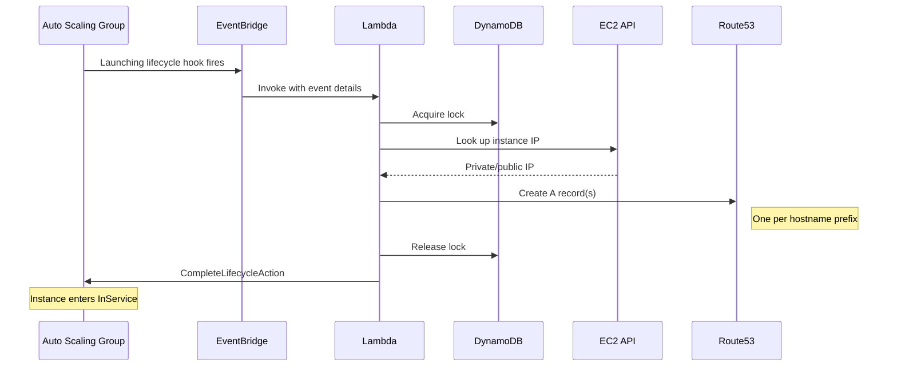
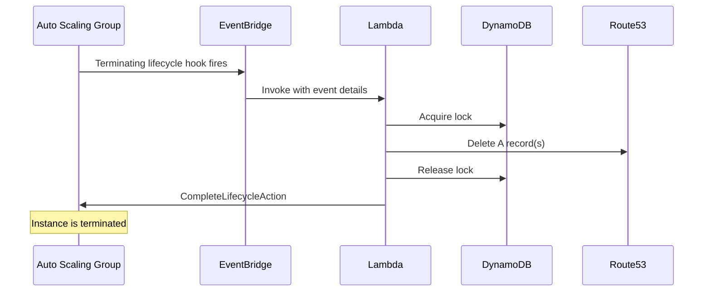

# Architecture

This document explains how the update-dns module works.

## Overview

The module uses ASG lifecycle hooks to trigger a Lambda function that
creates or deletes Route53 DNS A records when instances launch or
terminate.


## Components

### Lambda Function

The core component is a Python 3.12 Lambda function (`update_dns/main.py`)
that handles two event types:

- **`EC2 Instance-launch Lifecycle Action`** -- creates DNS A records
- **`EC2 Instance-terminate Lifecycle Action`** -- deletes DNS A records

The function receives lifecycle events via EventBridge, determines the
instance's IP address, and creates or deletes the appropriate Route53
records. It then completes the lifecycle hook so the ASG can proceed.

### EventBridge Rule

A CloudWatch EventBridge rule matches ASG lifecycle events for the
configured ASG name and routes them to the Lambda function:

```json
{
  "source": ["aws.autoscaling"],
  "detail-type": [
    "EC2 Instance-launch Lifecycle Action",
    "EC2 Instance-terminate Lifecycle Action"
  ],
  "detail": {
    "AutoScalingGroupName": ["<asg_name>"]
  }
}
```

### DynamoDB Lock Table

A DynamoDB table provides distributed locking to prevent race conditions
when multiple instances launch or terminate simultaneously. Each Lambda
invocation acquires a lock before modifying Route53 records and releases
it when done. The lock has a TTL matching the Lambda timeout to handle
failure cases.

### Lifecycle Hooks

The module generates semi-random lifecycle hook names (using a random
suffix) to avoid collisions. Users must create the actual hooks in their
ASG configuration using the names from the module outputs:

- `lifecycle_name_launching`
- `lifecycle_name_terminating`

## Instance Launch Sequence



## Instance Termination Sequence



## Hostname Resolution

The module supports three hostname modes:

### `_PrivateDnsName_` (default)

Generates hostnames from the instance's private IP address.
For example, an instance with private IP `10.1.2.3` and prefix `ip`
gets the record `ip-10-1-2-3.example.com`.

### `_PublicDnsName_`

Same as above but uses the instance's public IP address.
For example, `54.183.154.109` with prefix `ip` becomes
`ip-54-183-154-109.example.com`.

### Custom hostname

A literal string like `myhost` creates a single record
`myhost.example.com`. Prefixes are ignored in this mode.

## Multiple Prefixes

When using `_PrivateDnsName_` or `_PublicDnsName_`, you can specify
multiple prefixes. Each prefix creates a separate A record pointing
to the same IP. For example, with prefixes `["ip", "api", "web"]`
and IP `10.1.2.3`:

- `ip-10-1-2-3.example.com` -> `10.1.2.3`
- `api-10-1-2-3.example.com` -> `10.1.2.3`
- `web-10-1-2-3.example.com` -> `10.1.2.3`

## Monitoring

The Lambda function is deployed using the
[terraform-aws-lambda-monitored](https://registry.infrahouse.com/infrahouse/lambda-monitored/aws)
module, which provides:

- **Error alarm** -- triggers when Lambda errors occur
- **Throttle alarm** -- triggers when Lambda is throttled
- **Duration alarm** -- triggers when execution time approaches the timeout

All alarms notify via SNS to the configured `alarm_emails`.

## Security Model

### Lambda IAM Permissions

The Lambda function has scoped permissions for:

- **Auto Scaling** -- `CompleteLifecycleAction` on the specific ASG
- **EC2** -- `DescribeInstances`, `DescribeTags`, `CreateTags`
- **Route53** -- `ChangeResourceRecordSets`, `ListResourceRecordSets`,
  `GetHostedZone` on the specific hosted zone
- **DynamoDB** -- `PutItem`, `DeleteItem` on the lock table
