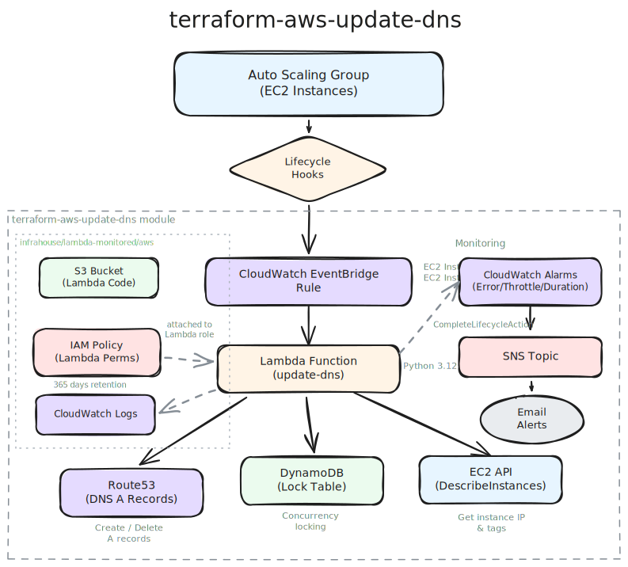

# InfraHouse Update DNS

This Terraform module automatically manages Route53 DNS A records for EC2
instances in an Auto Scaling Group. A Lambda function responds to ASG lifecycle
hook events via CloudWatch EventBridge, creating DNS records on instance launch
and deleting them on termination.

## Why This Module?

Some services running on EC2 instances in an Auto Scaling Group need a
stable, predictable DNS name for each node -- not just a load balancer
endpoint. The most common reason is **TLS certificates**: if a node needs
its own certificate (e.g., for inter-node encryption in an Elasticsearch
cluster), the certificate's Subject Alternative Name must match a
resolvable hostname. An ephemeral IP address won't work.

For example,
[terraform-aws-elasticsearch](https://github.com/infrahouse/terraform-aws-elasticsearch)
uses this module to give every node a DNS name like
`ip-10-1-2-3.example.com`. Puppet on the node then requests a TLS
certificate for that FQDN and configures Elasticsearch's transport layer
(`xpack.security.transport.ssl`) to use it. Without a known hostname,
inter-node TLS verification would fail.

Another use case is **poor man's load balancing**: set
`route53_hostname` to a fixed string like `"api"` and every instance in
the ASG gets an A record with the same name. Route53 returns all IPs in
round-robin order, giving you DNS-based load balancing with zero extra
infrastructure -- no ALB required.

Other use cases include cluster node discovery (nodes find peers by DNS
name rather than hard-coded IPs) and direct SSH/debugging access to
specific instances behind an ASG.

This module solves the problem natively within AWS:

| Aspect | This Module | DIY / Scripts |
|--------|-------------|---------------|
| **Trigger** | ASG lifecycle hooks (reliable) | Cron polling (delayed, can miss) |
| **Concurrency** | DynamoDB locking | None or manual |
| **Cleanup** | Automatic on termination | Often forgotten |
| **Monitoring** | Built-in CloudWatch alarms | Roll your own |
| **Multiple records** | Native prefix support | Custom scripting |

### Key Advantages

- **Zero external dependencies** -- only AWS services
  (Lambda, EventBridge, Route53, DynamoDB)
- **Lifecycle-hook driven** -- DNS records are created before the instance
  enters service and cleaned up on termination
- **Concurrency safe** -- DynamoDB-based locking prevents race conditions
  during rapid scale events
- **Built-in monitoring** -- Lambda errors, throttles, and duration are
  monitored via CloudWatch alarms with SNS notifications

## Architecture



## Features

- Automatic DNS A record creation on instance launch
- Automatic DNS record cleanup on instance termination
- Support for private or public IP addresses
- Support for custom hostnames or auto-generated names from IP
- Multiple DNS record prefixes per instance
- DynamoDB-based concurrency locking
- CloudWatch monitoring with configurable alert strategies
- Compatible with AWS provider v5 and v6

## Quick Start

```hcl
locals {
  asg_name = "my-web-servers"
}

module "update-dns" {
  source  = "registry.infrahouse.com/infrahouse/update-dns/aws"
  version = "1.3.0"

  asg_name        = local.asg_name
  route53_zone_id = data.aws_route53_zone.my_zone.zone_id
  alarm_emails    = ["ops-team@example.com"]
}

resource "aws_autoscaling_group" "web" {
  name = local.asg_name
  # ... other configuration ...

  initial_lifecycle_hook {
    lifecycle_transition = "autoscaling:EC2_INSTANCE_LAUNCHING"
    name                 = module.update-dns.lifecycle_name_launching
  }

  depends_on = [module.update-dns]
}
```

See the [Getting Started](getting-started.md) guide for a complete walkthrough.

## Documentation

- [Getting Started](getting-started.md) -- Prerequisites and first deployment
- [Architecture](architecture.md) -- How the module works
- [Configuration](configuration.md) -- All variables explained
- [Examples](examples.md) -- Common use cases
- [Troubleshooting](troubleshooting.md) -- Common issues and solutions
- [Changelog](changelog.md) -- Release history
